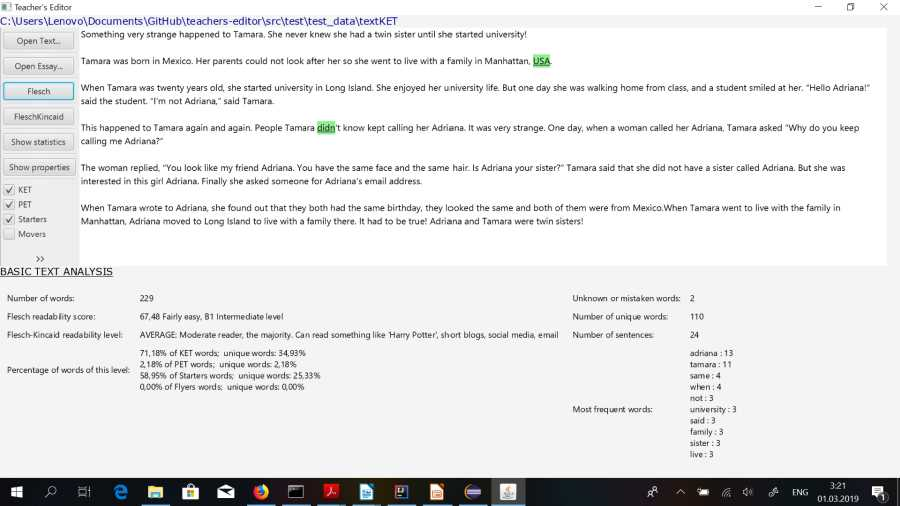

# ENGLISH TEACHER'S EDITOR

English Teacher's Editor is a Computer-Aided Language Learning Tool, a text processor aimed to help language teachers evaluate reading materials to select the most adequate ones for their students' proficiency level and assess students' written assignments. It implements a simple graphic user interface and NLP techniques.

## Features:

* Evaluate readability and the level of complexity: 
*uses Flesch Reading Ease and Flesch-Kincaid Grade Level scores adapted to second language learning;

* Check if the text is useful for a certain level
*shows the percentage of words corresponding to a certain ESL exam;

* See the top ten most frequent words in the document

* Count the word

* Check number of spelling mistakes

* Check the size of vocabulary used in the text

* Check the number of sentences

* Spellchecking

* Autocomplete

* See extended statistics on the text:
	* Vocabulary features: percentage of the words of major parts of speech;
	* Grammar features: percentage of the words with particular grammar properties:
		*  comparative and superlative adjectives;
     		*  modal verbs;
     		*  number of existential pronouns;
     		*  Present Simple Active;
     		*  Present Perfect Active;
     		*  Present Continuous Active;
     		*  Past Simple Active;
     		*  Past Perfect Active;
     		*  Past Continuous Active;
     		*  Present Perfect Continuous;
     		*  Future Simple Active;
     		*  Future Perfect Active;
     		*  Future Continuous;
	
* Simple Markov text generator

### The levels of English Proficiency treated (according to Cambridge Exams):
* Young learners:
	* Starters
	* Movers
	* Flyers
* KET
* PET
* FCE

## User Interface

## Usage
1. Download the repository

* The system depends on the installation of a number of external tools. The links to download the libraries are provided below.
  - Java version 1.8.0
  - Java FX Maven Plugin: https://mvnrepository.com/artifact/com.zenjava/javafx-maven-plugin/8.8.3
  - Richtext FX: https://mvnrepository.com/artifact/org.fxmisc.richtext/richtextfx/0.6.10
  - Stanford CoreNLP 3.9.2: https://stanfordnlp.github.io/CoreNLP/download.html
  - Stanford CoreNLP models: http://nlp.stanford.edu/software/stanford-corenlp-models-current.jar
  - Stanford CoreNLP POStagger english-left3words-distsim.tagger model:
   https://github.com/richardwilly98/test-stanford-tagger/blob/master/models/english-left3words-distsim.tagger
   
 #### Execution
3. Install the dependencies written above; the models are to be stored in the folder “model” in the project
directory;
4. Make sure your downloaded the "data" folder and placed it in the project directory;
5. Run the class application.Main.java.

