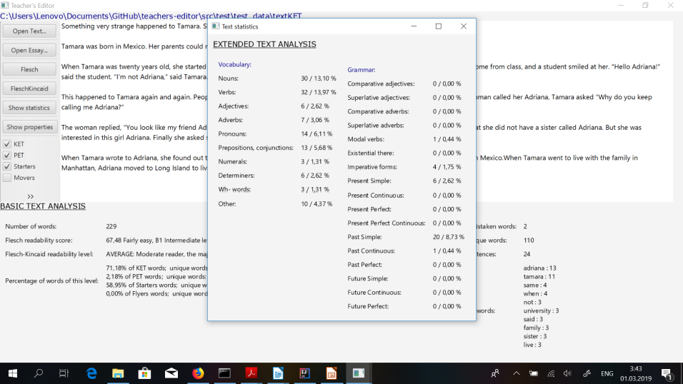

# ENGLISH TEACHER'S EDITOR

English Teacher's Editor is a Computer-Aided Language Learning Tool, a text processor aimed to help language teachers evaluate reading materials to select the most adequate ones for their students' proficiency level and assess students' written assignments. It implements a simple graphic user interface and NLP techniques.

## Features:

* Evaluate readability and the level of complexity:
*uses Flesch Reading Ease and Flesch-Kincaid Grade Level scores adapted to second language learning;

* Check if the text is useful for a certain level
	*shows the percentage of words corresponding to a certain ESL exam;

* See the top ten most frequent words in the document

* Count the words

* Check number of spelling mistakes

* Check the size of vocabulary used in the text

* Check the number of sentences

* Spellchecking

* Autocomplete

* See extended statistics on the text:
	* Vocabulary features: percentage of the words of major parts of speech;
	* Grammar features: percentage of the words with particular grammar properties:
		*  comparative and superlative adjectives;
     		*  modal verbs;
     		*  number of existential pronouns;
     		*  Present Simple Active;
     		*  Present Perfect Active;
     		*  Present Continuous Active;
     		*  Past Simple Active;
     		*  Past Perfect Active;
     		*  Past Continuous Active;
     		*  Present Perfect Continuous;
     		*  Future Simple Active;
     		*  Future Perfect Active;
     		*  Future Continuous;
	
* Simple Markov text generator

### The levels of English Proficiency treated (according to Cambridge Exams):

Level | Young Learners | School
------|--------------- | -------
Pre A1|Starters	| -
A1|Movers | -
A2 |Flyers | KET
B1 |-	|PET
B2 | - | FCE
B1-C2 | - | IELTS
B1-C2 | - | TOEFL

## User Interface

Simple and easy to use interface

Main Window: 

## Folders and Files:
**`Javadoc`** - contains html files; You can download the folder and open `index.html` to view the full API;  
**`data`** - contains the dictionary file, the wordlists and the sample texts;  
**`src`** - contains the source code;  
* `main` - contains the source code and the test code;
	* `java` - contains the source code:
		* `application`: view and controller classes:
			* `AutocompleteArea.java` - contains the implementation of the text area;\
			* `Loader.java` - contains a class to load data from files (reference dictionary and wordlists).\
			* `Main.java` - the file to start the application.\
			* `MainTextController.java` - contains the class that links MainTextStatistics interface methods implemented in
			AbstractDocument and the user interface; linked to MainTextView.
			* `MainTextView.java` - contains the main window of the GUI, with AutocompleteArea and .
			* `TextStatisticsController.java` - contains the class that links ExtendedTextStatistics interface methods
			implemented in AbstractDocument with the TextStatisticsView.
			* `TextStatisticsView.java` - contains the popup window with the TextStatisticsController output:
			statistics on the parts-of-speech and grammar features.	
		* `document` : main text processing functionality:
			* `AbstractDocument.java` - contains the string content of a text file, its attributes (lists and frequencies of
			different features), methods to extract them.
			* `Essay.java`  - contains the functionality of the document of a type Essay, a student's written work Extends
			AbstractDocument.
			* `ExtendedTextStatistics.java` - contains the interface to record the methods requested by a user when pressing
			"Show statistics" button in the GUI. It is used to conveniently separate the methods for basic and extended
			analysis of the text. 
			* `FileContent.java` - contains methods to get the string content of the text file; 
			will be updated with the methods treating various file formats.
			* `GrammarEvaluation.java` - contains the clas for grammar properties of the text and instruments to get them.
			* `MainTextStatistics.java` - contains the interface to record the methods with output displayed in the main
			view of the GUI.
			* `PosTagger.java` - contains the methods to get lexical properties of the documens. Uses Stanford Maximum
			Entropy POS-tagger.
			* `ReadingMaterial` - contains the functionality of a text used for reading exercises, extends
			AbstractDocument.
			* `Tokenizer` - contains a helper class used for tokenization of text files.	
		* `generation`: Markov text generator:
			* `MarkovGenerator.java` - contains an implementation of MarkovGenerator using a HashMap of a String array and a
			HashMap.	
		* `spellcheck`: contains spellchecker and autocomplete
			* `AutocompleteOptions.java` - contains an implementation of autocomplete using a trie structure; accessed via
			interface Autocompleter.
			* `Autocompleter.java` - contains the interface representing autocompleter, called in GUI.
			* `Spellcheker.java` - contains the interface representing spelling checking functionality, called in GUI.
			* `SuggestionsSpelling.java` - contains an implementation of a spellchecker using character distance algorithm;
			accessed via Spellchecker interface.
			* `TrieNode.java` - contains a helper class to create the Trie structure used in Autocompleter.	
		* `vocabulary` : contains the classes to process and store reference dictionaries and wordlists:
			* `DictionaryTree.java` - contains a class with a reference dictionary built as a TreeSet data structure.
			* `Vocabulary.java` - contains a class with wordlist and its methods built as a HashSet.
			* `VocabularyBuilder.java` - contains the interface representing the functionality of a vocabulary object;
			accessed in GUI.
			* `VocabularyFileProcessor.java` - contains a helper class to extract words from vocabulary files and rewrite
			wordlists into 1 word per line files.
			* `VocabularyLoader` - contains a class to load vocabulary from files into VocabularyBuilder object.
	* `resources` - contains configuration .ini file, can be ignored;
* `test`: test resources (not complete, is being update).
		

## Setup & Usage
### Execution

The project is built using Java version 1.8.0 and Maven framework with IntelliJ IDEA IDE.

1. Download the repository;
2. Open the project in one of the IDEs, such as Eclipse or IntelliJ.
3. Install the dependencies:

The system depends on the installation of a number of external tools. The links to download the libraries are provided below.
  - Java version 1.8.0
  Make sure the following libraries are installed. If not, download and add them to the class/build path:
  
  - SLF4J NOP Binding https://mvnrepository.com/artifact/org.slf4j/slf4j-nop
  - Java FX Maven Plugin: https://mvnrepository.com/artifact/com.zenjava/javafx-maven-plugin/8.8.3
  - Richtext FX: https://mvnrepository.com/artifact/org.fxmisc.richtext/richtextfx/0.6.10
  - Stanford CoreNLP 3.9.2: https://stanfordnlp.github.io/CoreNLP/download.html
  - Stanford CoreNLP models: http://nlp.stanford.edu/software/stanford-corenlp-models-current.jar
  
4. Create the folder "models" in your project directory, save the Stanford CoreNLP models file `stanford-english-corenlp-2018-10-05-models` to this foolder; save the POS tagger `english-left3words-distsim.tagger` model to this folder;
5. Make sure your downloaded the "data" folder and placed it in the project directory;
6. Run the class `application.Main.java`.

#### Usage
1. Open the file: you have options to open your files as a Text or as an Essay. The difference is in the desired interpretation of the readability scores  
2. Choose the statistics you would like to be computed and press the corresponding button:  
*Flesch* – calculate Flesch Reading Ease score;  
*Flesch-Kincaid*  -  Flesch-Kincaid Grade Level score adapted to second language learning;  
*Show statistics* – to open the pop-up window displaying grammar and vocabulary features of the text: the number and the percentage of the following forms:   
*Vocabulary features*: number and percentage of words of major parts of speech (nouns, verbs, adjectives, adverbs, prepositions and conjunctions, pronouns, numerals, determiners, wh-words; other – for the words that don’t fit into any of these categories);  
*Grammar features*: number and percentage of the words with particular grammar properties: comparative and superlative adjectives; modal verbs; number of imperative forms; number of existential pronouns; Present Simple Active; Present Perfect Active; Present Continuous Active; Past Simple Active; Past Perfect Active. Past Continuous Active; Present Perfect Continuous; Future Simple Active; Future Perfect Active; Future Continuous;   
        
Click *Show properties* – to see the top ten most frequent words in the document, number of words and sentences, number of spelling mistakes or unknown words, the size of vocabulary (number of unique words) used in the text.  

To see the percentage of words corresponding to a certain ESL exam, check the boxes with a corresponding level and click *Check the level* button.

To enable *Spellchecking* and *Autocomplete*, check the corresponding boxes. The options for autocomplete will appear near the cursor as soon as you start typing. To see spelling suggestions, click on the highlighted word.   
To replace the word with this option, select the option from the menu. You can save a highlighted word in the program’s dictionary by choosing *“Add to dictionary”* option.

